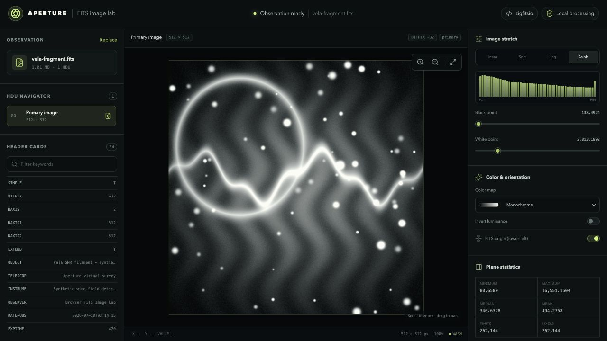
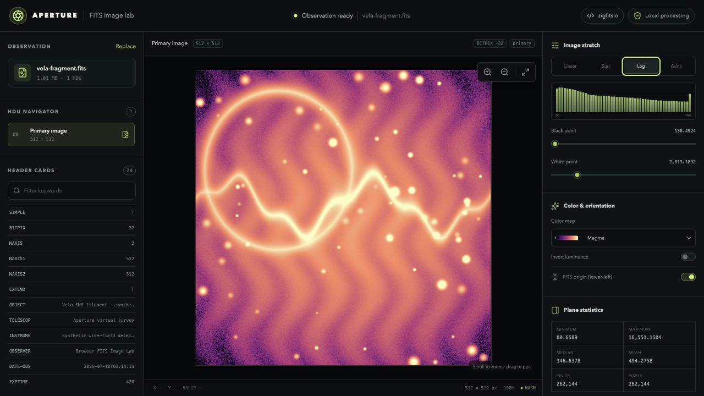

# zigfitsio

[](https://github.com/anhydrous99/zigfitsio/actions/workflows/ci.yml)
[](https://pypi.org/project/zigfitsio/)
[](https://www.npmjs.com/package/zigfitsio)
[](https://ziglang.org)
[](./LICENSE)

**FITS 4.0 I/O in pure Zig — zero C dependencies — with Python and TypeScript/WebAssembly bindings.**

zigfitsio implements the [*Definition of the FITS Standard*, Version 4.0](https://fits.gsfc.nasa.gov)
end to end, with interoperability verified in **both directions** against CFITSIO 4.6.4 and Astropy.

## Demo: Aperture

[**Aperture**](https://anhydrous99.github.io/web-fits-viewer/) is a browser-based FITS image lab
built on zigfitsio's TypeScript/WebAssembly bindings. Open a local `.fits` or `.fits.gz` file—or
load the bundled demo observation—to navigate image HDUs, inspect header cards and plane statistics,
and tune stretch, color, orientation, zoom, and pan. Processing stays entirely in the browser.

**[Launch the live demo](https://anhydrous99.github.io/web-fits-viewer/)** ·
**[View the demo source](https://github.com/anhydrous99/web-fits-viewer)**

| Inspect an observation | Explore stretch and color |
| :---: | :---: |
| [](https://anhydrous99.github.io/web-fits-viewer/) | [](https://anhydrous99.github.io/web-fits-viewer/) |

## Features

- **Images** — all six `BITPIX` types, `BSCALE`/`BZERO` scaling, null handling, strided sections.
- **Tables** — ASCII and binary, every `TFORM` code, `TDIM`, variable-length arrays.
- **Compression** — RICE_1, GZIP_1/2, PLIO_1, HCOMPRESS_1 (including lossy and quantized floats), read **and** write.
- **WCS** — celestial (`TAN`/`SIN`/`ARC`/`STG`/`ZEA`/`CAR`), spectral, and time-coordinate transforms.
- **Integrity** — `DATASUM`/`CHECKSUM` compute/update/verify, `fitsverify`-style structural validation.
- **Backends** — file, in-memory, stream/gzip, and HTTP I/O; transparent `.fits.gz`; CFITSIO-style extended filenames.
- **Headers** — `CONTINUE` long strings, `HIERARCH` keywords, complex-valued cards, ASCII templates.

## Install

### Zig (requires Zig 0.16)

```sh
zig fetch --save git+https://github.com/anhydrous99/zigfitsio
```

```zig
// build.zig
const fits = b.dependency("zigfitsio", .{ .target = target, .optimize = optimize });
exe.root_module.addImport("zigfitsio", fits.module("zigfitsio"));
```

### Python

```sh
pip install zigfitsio
```

See [`bindings/python/README.md`](./bindings/python/README.md).

### TypeScript / JavaScript

```sh
npm install zigfitsio
```

See [`bindings/typescript/README.md`](./bindings/typescript/README.md).

## Quickstart

### Zig

```zig
const fits = @import("zigfitsio");

// Write a 256×256 float image.
var out = try fits.createFile(allocator, "img.fits", .{});
defer out.deinit();
var img = try fits.ImageView.append(&out, .{ .bitpix = -32, .axes = &.{ 256, 256 } });
try img.writeAll(f32, pixels, .{});
try out.flush();

// Read it back — scaling applied, stored type converted, in bounded chunks.
var in = try fits.openFile(allocator, "img.fits", .read_only, .{});
defer in.deinit();
var view = try fits.ImageView.of(&in, in.current());
const buf = try allocator.alloc(f32, @intCast(view.elementCount()));
defer allocator.free(buf);
try view.readAll(f32, buf, .{ .null_sentinel = 0.0 });
```

### Python

```python
import numpy as np, zigfitsio as zf

zf.writeto("img.fits", np.arange(12, dtype="f4").reshape(3, 4), overwrite=True)
with zf.open("img.fits") as hdul:
    print(hdul[0].data, hdul[0].header["NAXIS1"])
```

### TypeScript

```ts
import * as zf from "zigfitsio";

zf.writeTo("img.fits", new zf.FitsArray(Float32Array.from({ length: 12 }, (_, i) => i), [3, 4]), { overwrite: true });
using hdul = zf.open("img.fits"); // `using` closes the handle at scope exit
console.log(hdul.image(0).data, hdul.image(0).header.get("NAXIS1"));
```

## Language bindings

The pure-Zig library in `src/` is unchanged; everything under [`bindings/`](./bindings) is additive:

- **C ABI** ([`bindings/c/zigfitsio.h`](./bindings/c/zigfitsio.h), `zig build capi`) — a shared library
  exporting `zf_*` symbols with CFITSIO-compatible status ints. Purpose-built for bindings; **not** a
  CFITSIO `fits_*` drop-in.
- **Python** (PyPI `zigfitsio`) — a NumPy-first, `astropy.io.fits`-style API over a 1:1 `ctypes`
  layer (`zigfitsio.lowlevel`). Prebuilt wheels; no C compiler needed.
- **TypeScript/JavaScript** (npm `zigfitsio`) — the same two layers over a single bundled
  WebAssembly module. Runs on Node ≥18, Bun, and browsers; no native addons.

## Interoperability

Cross-tool compatibility is verified, not just self-consistent: a committed **CFITSIO 4.6.4 +
`fpack`** golden corpus ([`test/golden/`](./test/golden)) is decoded hermetically on every CI cell
(including big-endian s390x), and a dedicated CI job opens every zigfitsio-written file with
CFITSIO `funpack`, Astropy, and `fitsverify`. Lossy HCOMPRESS decoding reproduces `funpack`
bit-for-bit. Known limits: [`CAVEATS.md`](./CAVEATS.md).

## Development

```sh
zig build              # build the static library
zig build test         # run the test suite
zig build capi         # build the C-ABI shared library (for the Python bindings)
zig build capi-test    # test the C-ABI shim
zig build bench        # throughput benchmarks
zig build fitsverify   # run the structural-validation CLI demo
zig build fuzz         # fuzz the header/table parsers
zig build wasm-check   # compile the core for wasm32-freestanding
```

Release history: [`CHANGELOG.md`](./CHANGELOG.md).

## License

MIT — see [`LICENSE`](./LICENSE).
